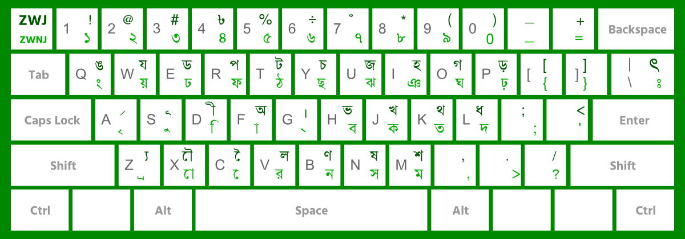
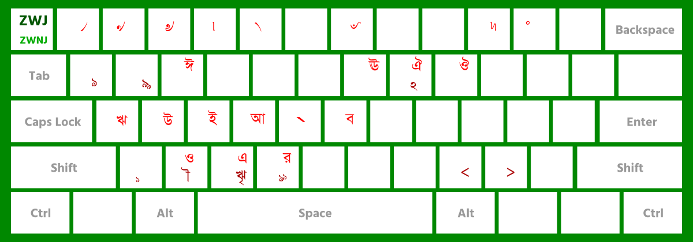

# Unijoy Keyboard Layout for macOS

[Unijoy](https://ekushey.org/keyboard-layout/ekusheyr-shadhinota-unijoy-layout/)
is one of the most popular Bengali keyboard layouts. This repository packages
it for macOS and ships it through Homebrew, a `.pkg` installer, and a small
shell installer.

## Layout

**Default layer**



**With Option (Alt) held**



> The diagrams above show the original Unijoy character placements. The
> `` ` ``/`~` key (top-left, just below `Esc`) has been remapped — see
> [Special characters](#special-characters) below.

## Special characters

The `` ` ``/`~` key is overloaded to put the four most useful "non-letter"
Bengali typing helpers on a single physical key:

| Keystroke                                | Output                          | Codepoint |
|------------------------------------------|---------------------------------|-----------|
| `` ` ``                                  | **ZWNJ** (Zero Width Non-Joiner) | `U+200C`  |
| `Shift` + `` ` ``                        | **ZWJ** (Zero Width Joiner)      | `U+200D`  |
| `⌥ Option` + `` ` ``                     | `‘` (left single quote)          | `U+2018`  |
| `Shift` + `⌥ Option` + `` ` ``           | `’` (right single quote)         | `U+2019`  |

ZWNJ is essential for breaking incorrect conjunct formation. For example,
to type **র‌্যাব** (RAB) you need a ZWNJ between `র` and the `্য` cluster,
otherwise `র + ্ + য` renders as a *reph* (**র্য**):

```
V   ` Shift+Z  F  H
র   ‌  ্য       া  ব     →  র‌্যাব
```

> Backtick `` ` `` and tilde `~` are no longer reachable from this layout.
> Switch to a US ABC input source momentarily if you need them.

## Installation

Pick whichever method you're most comfortable with. All four install the
same two files (`unijoy.keylayout` and `unijoy.icns`) into
`/Library/Keyboard Layouts/`.

### Option 1: Homebrew (recommended)

If you have [Homebrew](https://brew.sh/) installed:

```bash
brew install --cask milon/macos-unijoy/macos-unijoy
```

Homebrew uses its `keyboard_layout` artifact to drop the files into place
directly — the `.pkg` from Option 3 is not involved, so there is no
Gatekeeper prompt.

To uninstall later:

```bash
brew uninstall --cask macos-unijoy
```

### Option 2: One-line shell installer

```bash
/bin/bash -c "$(curl -fsSL https://raw.githubusercontent.com/milon/macos-unijoy/master/install.sh)"
```

The script clones this repository to a temporary directory and copies the
layout files using `sudo`. It requires `git` (pre-installed on macOS) and
prompts for your sudo password.

### Option 3: Installer package (`.pkg`)

Download `Unijoy-Installer.pkg` from the
[latest release](https://github.com/milon/macos-unijoy/releases), double-click
it, and follow the on-screen steps. macOS will ask for your administrator
password so the installer can write to `/Library/Keyboard Layouts/`.

> [!IMPORTANT]
> **Seeing _"Apple could not verify … is free of malware"_?**
>
> The installer is not signed with an Apple Developer ID, so macOS Gatekeeper
> blocks it on first launch. The package is safe — you can verify the contents
> yourself with `pkgutil --payload-files Unijoy-Installer.pkg`. To allow it:
>
> **Easiest — System Settings:**
>
> 1. Double-click the `.pkg` once and dismiss the warning dialog.
> 2. Open **System Settings → Privacy & Security**.
> 3. Scroll to the **Security** section. You'll see a message about
>    *"Unijoy-Installer.pkg was blocked…"* with an **Open Anyway** button.
>    Click it and authenticate.
> 4. Double-click the `.pkg` again — a new dialog will offer an **Open** button.
>
> **Alternative — Terminal (bypasses Gatekeeper directly):**
>
> ```bash
> sudo installer -pkg ~/Downloads/Unijoy-Installer.pkg -target /
> ```
>
> Or remove the quarantine flag and then double-click normally:
>
> ```bash
> xattr -d com.apple.quarantine ~/Downloads/Unijoy-Installer.pkg
> ```

### Option 4: Manual installation

- Download `unijoy.keylayout` and `unijoy.icns` from the repository root.
- Copy both files into `/Library/Keyboard Layouts/` using Finder.
- Follow the post-install steps below to enable the layout.

## Enabling the layout

After any of the installation methods above:

1. Open **System Settings → Keyboard**.
2. Under **Input Sources**, click **Edit…**.
3. Click the **+** button at the bottom-left corner.
4. Choose **Other**, select **বাংলা (Unijoy)**, and click **Add**.
5. *(Optional)* Set a keyboard shortcut from the **Shortcuts** tab.

> If the new layout does not appear, log out and back in (or restart) to
> refresh the system input-source list.

## Building the installer from source

The installer package can be rebuilt locally on macOS:

```bash
./build-installer.sh
```

This produces `dist/Unijoy-Installer.pkg`. Optional environment variables:

- `VERSION` — version string baked into the package (default: `1.0`).
- `IDENTIFIER` — package identifier (default: `com.milon.Unijoy`).
- `SIGN_IDENTITY` — Developer ID Installer identity used to sign the package
  (e.g. `"Developer ID Installer: Your Name (TEAMID)"`).

The build uses Apple's `pkgbuild` and `productbuild`, both of which ship with
macOS and the Command Line Tools.

## Releasing

A GitHub Actions workflow at `.github/workflows/release.yml` runs on every
`v*` tag push and:

1. Builds `Unijoy-Installer-X.Y.Z.pkg` on `macos-latest`.
2. Publishes it to a new GitHub Release named `Unijoy vX.Y.Z`.
3. Bumps the Homebrew cask in
   [`milon/homebrew-macos-unijoy`](https://github.com/milon/homebrew-macos-unijoy)
   with the new version and source-tarball SHA256.

To cut a release:

```bash
git tag v1.2.3 -m '<Release Message>'
git push --tags
```

The cask bump step requires a `TAP_PUSH_TOKEN` repository secret — a
fine-grained PAT with **Contents: Read and write** permission on the tap
repo. Without it, the release still ships the `.pkg`, but the Homebrew tap
will not auto-update.

## Credits

- **Unijoy keyboard layout** — designed by the [Ekushey](https://ekushey.org/)
  project. All credit for the layout itself, the character placement, and the
  original artwork belongs to them.
- **macOS port and installer** — maintained by
  [@milon](https://github.com/milon).
- **License** — this repository packages the Unijoy layout for macOS; the
  layout itself remains the work of its original authors. Please refer to the
  [Ekushey project](https://ekushey.org/) for licensing of the layout.
- Inspired by [UniJoy_osx](https://github.com/nuxrif/UniJoy_osx) by Sharif
  Ahammed.

## Contact

Found a bug? Have a suggestion? Want to contribute?

- **Issues & feature requests** — open a ticket on the
  [GitHub issue tracker](https://github.com/milon/macos-unijoy/issues).
- **Pull requests** — welcome! Fork the repo, make your changes, and open
  a PR against `master`.
- **Maintainer** — [@milon on GitHub](https://github.com/milon).
